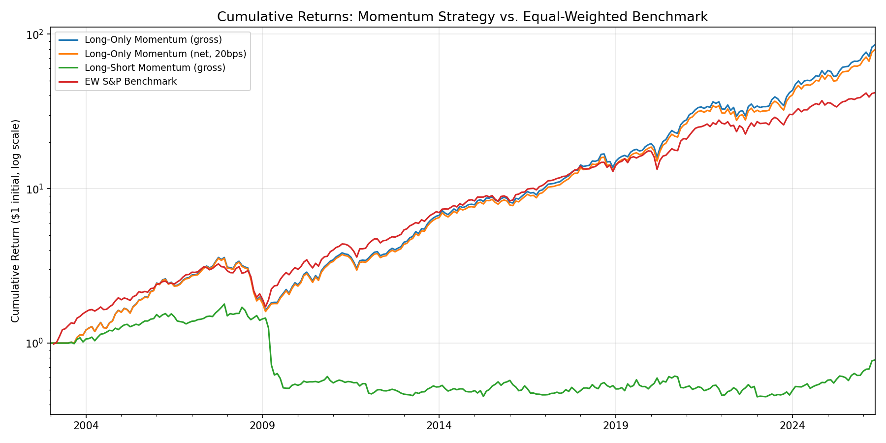
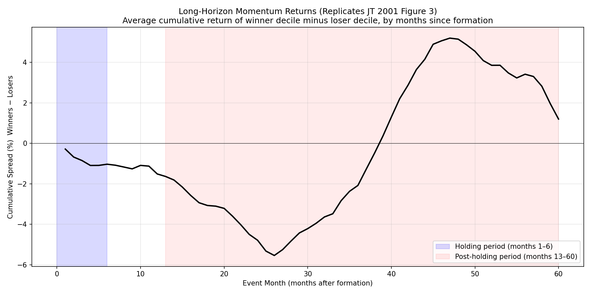
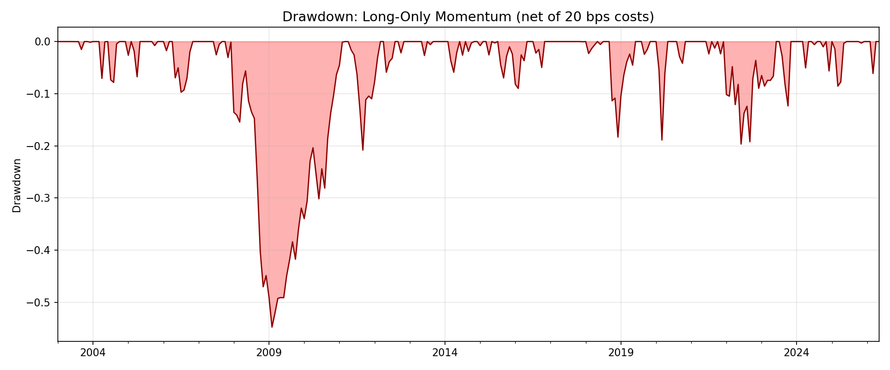
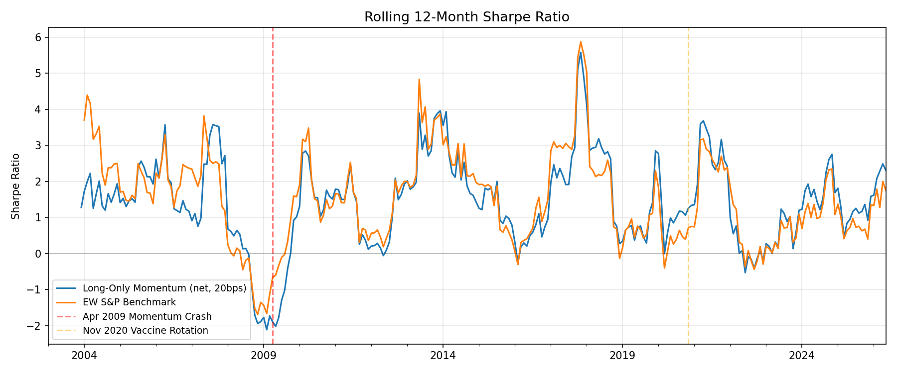

# Momentum Backtest: S&P 500, 2003–2026
 
My implementation of the cross-sectional momentum strategy from Jegadeesh & Titman (2001), "Profitability of Momentum Strategies: An Evaluation of Alternative Explanations," tested on the modern S&P 500 universe.
 

 
## Headline result
 
Long-only top-decile momentum on current S&P 500 constituents. Six-month formation, six-month holding, equal-weighted within each decile, six overlapping cohorts active at any time. Following the JT 2001 spec exactly.
 
| Metric | Value |
|---|---|
| CAGR (net of 20 bps round-trip costs) | **20.53%** |
| Annualized volatility | 18.47% |
| Sharpe ratio | **1.11** |
| Max drawdown | −54.8% |
| Hit rate (months > 0) | 66.2% |
| 4-Factor alpha (Fama-French + UMD) | **+5.98%/yr** (t = 3.66) |
| Sample length | 23 years, 279 months |
 
The strategy beats the equal-weighted S&P 500 by +3.4% per year gross, and retains 5.98% per year of alpha after controlling for the market, size, value, and academic momentum factors. The t-statistic of 3.66 is well above the conventional significance threshold of 2.
 
## Interesting Findings

The classical long-short variant — long the top decile, short the bottom — earned essentially zero in this sample (Sharpe 0.03 gross). That's not a bug. It's survivorship bias, and it's the most important finding in this project.
 
My universe is current S&P 500 members. Every name in the panel survived to today by definition. The "losers" in my cross-section aren't Lehman, Bear Stearns, Circuit City, or Enron — those are absent because they died. The losers are blue-chip companies that had a rough 6 months but didn't go to zero: banks during the financial crisis, energy stocks during oil crashes, Meta in 2022, healthcare names in 2023. These names mean-revert *harder* than the winners do, because they're high-quality firms temporarily out of favor.
 
This shows up explicitly in the long-horizon analysis. JT 2001's Figure 3 showed the cumulative winners-minus-losers spread rising to +12% by month 12, then decaying back toward zero by month 60. My replication shows the *opposite* shape in the short term: the spread is slightly negative during the standard holding period, deepens to ~−5.5% around event month 26, then crosses zero and peaks at +5% around event month 47. The inversion is the survivorship-bias signature.
 

 
So the practically investable version of momentum in this universe is long-only, and the analysis is structured around that. The long-short result is reported honestly as a failed replication caused by the data, not by the method.
 
## What I built
 
```
momentum-backtest/
├── data/
│   ├── raw/                # downloaded prices (parquet), constituent CSV
│   └── processed/          # signal, returns, decile books, strategy series
├── src/
│   ├── data.py             # yfinance download + cleaning
│   ├── signals.py          # 6-month return signal, monthly resampling
│   ├── portfolio.py        # decile sort + overlapping-cohorts construction
│   ├── backtest.py         # generates pre-cost return series
│   ├── costs.py            # 10/20/30/50 bps cost sensitivity
│   ├── analytics.py        # Sharpe, drawdown, charts
│   ├── benchmark.py        # equal-weighted S&P comparison
│   ├── long_horizon.py     # JT 2001 Figure 3 replication
│   └── attribution.py      # Fama-French 3F + 4F (with UMD) regressions
└── reports/                # charts and regression output
```
 
## How to run
 
```bash
git clone <repo>
cd momentum-backtest
python -m venv .venv
source .venv/bin/activate
pip install -r requirements.txt
 
# Run the pipeline in order
python src/data.py            # downloads ~5,900 days × 502 tickers
python src/signals.py         # builds the momentum signal
python src/portfolio.py       # decile sort + overlapping cohorts
python src/backtest.py        # gross return series
python src/costs.py           # apply transaction cost model
python src/analytics.py       # metrics + charts
python src/benchmark.py       # equal-weighted comparison
python src/long_horizon.py    # 60-month event study
python src/attribution.py     # Fama-French regressions
```
 
The full pipeline takes ~5–7 minutes end-to-end, most of which is the yfinance download.
 
## Detailed results
 
### Performance, all variants
 
| Strategy | CAGR | Sharpe | Max DD | Hit Rate |
|---|---:|---:|---:|---:|
| Long-Only Momentum (gross) | 20.92% | 1.13 | −54.5% | 66.2% |
| Long-Only Momentum (net 20bps) | **20.53%** | **1.11** | −54.8% | 66.2% |
| Long-Short Momentum (gross) | −1.07% | 0.03 | −74.9% | 56.2% |
| Equal-Weighted S&P Benchmark | 17.35% | 1.08 | −47.3% | 68.6% |
 
### Cost sensitivity (long-only)
 
| Round-trip cost | Ann. Return | Sharpe |
|---:|---:|---:|
| Gross | 20.85% | 1.13 |
| 10 bps | 20.69% | 1.12 |
| 20 bps | 20.53% | 1.11 |
| 30 bps | 20.37% | 1.10 |
| 50 bps | 20.05% | 1.09 |
 
The long leg is essentially cost-insensitive. Going from gross to 50 bps round-trip drops me from 20.85% to 20.05% — about 80 bps per year. Math checks: 13.31% monthly turnover × 50 bps × 12 ≈ 0.80%. The alpha is not a turnover illusion.
 
### Factor attribution
 
Long-only (net of 20 bps), regressed on Fama-French factors with Newey-West HAC standard errors at 6 lags:
 
| Model | Alpha (annualized) | t-stat | R² |
|---|---:|---:|---:|
| 3-Factor (Mkt-RF, SMB, HML) | +7.49% | +3.89 | 0.786 |
| 4-Factor (+ UMD momentum) | **+5.98%** | **+3.66** | 0.863 |
 
Factor loadings for the 4-factor model:
 
| Factor | Beta | t-stat |
|---|---:|---:|
| Market (Mkt-RF) | +1.150 | +30.77 |
| Size (SMB) | +0.299 | +4.78 |
| Value (HML) | +0.091 | +1.58 |
| Momentum (UMD) | +0.384 | +6.52 |
 
The UMD loading is only 0.38 rather than ~1.0 because the strategy is long-only and equal-weighted, while UMD is long-short and value-weighted. So I'm only capturing the long half of momentum, with a small-cap tilt that UMD doesn't have. That leaves residual alpha beyond all four canonical factors.
 
The long-short variant is a different story: UMD beta of 0.998 (t = 12.47), 4F alpha of −3.23% (not significant, t = −1.47). My long-short *is* the academic momentum factor dollar-for-dollar, with a slight negative residual that's consistent with the survivorship-bias drag on the short leg.
 
### Drawdown and rolling Sharpe
 

 

 
The 2008–2009 drawdown is brutal — peak-to-trough of −55% — and took roughly 18 months to recover. That's the price of admission for momentum and is the central risk story for the strategy. The April 2009 momentum crash (documented by Daniel & Moskowitz 2016) shows up exactly where it should on the rolling Sharpe chart.
 
## Limitations
 
 
1. **Survivorship bias** is the dominant data issue. Using current S&P 500 constituents means all names in the universe survived to today. This biases the long leg upward (only good companies are present), and *especially* biases the short leg upward (the "losers" are bouncing-back survivors, not truly distressed firms). The 5.98% 4F alpha is likely smaller in a delisted-firm-inclusive universe — but the t-statistic of 3.66 is robust enough that the result isn't just noise.
2. **11 of 503 tickers failed to download** from yfinance due to recent delistings, mergers, or acquisitions (Juniper → HPE, Hess → Chevron, Ansys → Synopsys, Walgreens went private, etc.), leaving 502 names in the final panel.
3. **No skip month at the signal/holding boundary.** Following JT 2001 exactly, which differs from the 12-1 specification of JT 1993. A skip-month variant could be tested in sensitivity analysis.
4. **Equal-weighted within each decile**, which tilts toward smaller names in the index. The SMB loading of 0.30 in the 4-factor regression confirms this. A value-weighted variant would likely have lower returns and lower SMB exposure.
5. **Short-leg infeasibility.** Even if survivorship bias were addressed, the long-short would face high short-borrow costs and operational difficulty on smaller-cap S&P names. The long-only framing is closer to what's actually investable.
## What I'd do with more time
 
- Point-in-time S&P 500 membership history (CRSP, if I had access) to address survivorship bias directly
- Industry-neutral momentum (subtract industry-average return from each stock's signal)
- Residual momentum (rank on idiosyncratic returns after stripping factor exposures)
- Time-series momentum (per-stock signed exposure rather than cross-sectional ranking)
- Full sensitivity sweep across lookback windows (3, 6, 9, 12 months) and decile cutoffs (10%, 20%, 30%)
- Capacity analysis: estimate the AUM at which trades start moving prices
## References
 
Jegadeesh, N., & Titman, S. (2001). Profitability of Momentum Strategies: An Evaluation of Alternative Explanations. *Journal of Finance*, 56(2), 699–720.
 
Jegadeesh, N., & Titman, S. (1993). Returns to Buying Winners and Selling Losers: Implications for Stock Market Efficiency. *Journal of Finance*, 48(1), 65–91.
 
Daniel, K., & Moskowitz, T. J. (2016). Momentum Crashes. *Journal of Financial Economics*, 122(2), 221–247.
 
Asness, C., Frazzini, A., Israel, R., & Moskowitz, T. J. (2014). Fact, Fiction, and Momentum Investing. *Journal of Portfolio Management*, 40(5), 75–92.
 
Fama, E. F., & French, K. R. (1993). Common Risk Factors in the Returns on Stocks and Bonds. *Journal of Financial Economics*, 33, 3–56.
 
Factor data: Ken French's data library, Tuck School of Business at Dartmouth (https://mba.tuck.dartmouth.edu/pages/faculty/ken.french/data_library.html).
 